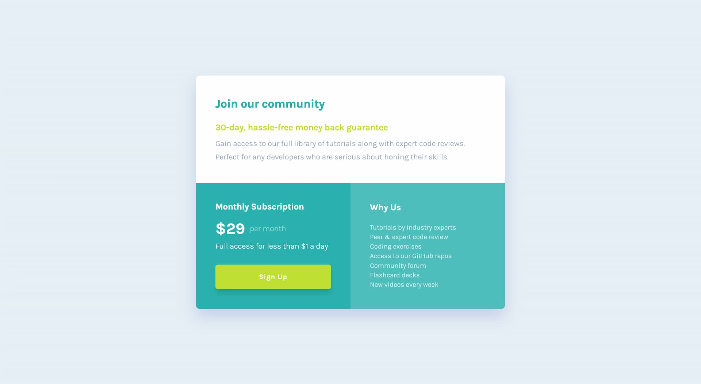

# Frontend Mentor - Single price grid component solution

This is a solution to the [Single price grid component challenge on Frontend Mentor](https://www.frontendmentor.io/challenges/single-price-grid-component-5ce41129d0ff452fec5abbbc). Frontend Mentor challenges help you improve your coding skills by building realistic projects.

## Table of contents

- [Overview](#overview)
  - [The challenge](#the-challenge)
  - [Screenshot](#screenshot)
  - [Links](#links)
- [My process](#my-process)
  - [Built with](#built-with)
  - [What I learned](#what-i-learned)
  - [Continued development](#continued-development)
  - [Useful resources](#useful-resources)
- [Author](#author)
- [Acknowledgments](#acknowledgments)

## Overview

### How to run the project

```sh
# install dependencies
pnpm i

# run the dev server
pnpm dev

# build for production
pnpm build

# preview build version
pnpm preview
```

> Node version: v21.5.0  
> pnpm version: 8.15.0

### The challenge

Users should be able to:

- View the optimal layout for the component depending on their device's screen size
- See a hover state on desktop for the Sign Up call-to-action

### Screenshot



### Links

- Solution URL: [https://www.frontendmentor.io/solutions/single-price-grid-component-with-scss-and-vite-SahM4cOtYX](https://www.frontendmentor.io/solutions/single-price-grid-component-with-scss-and-vite-SahM4cOtYX)
- Live Site URL: [https://gorgeous-sorbet-f5dd63.netlify.app/](https://gorgeous-sorbet-f5dd63.netlify.app/)

## My process

- Prepare the project structure with [Vite](https://vitejs.dev/).
- Inspect the design, and style guide. Read the requirement
- Plan the different element to code
- Implement the HTML
- Implement styles for the mobile version
- Add media queries and adapt styles for the desktop version
- Adjust styles with [PerfectPixel](https://www.welldonecode.com/perfectpixel/)
- Add clamp values where needed with [https://websemantics.uk/tools/fluid-responsive-property-calculator/](https://websemantics.uk/tools/fluid-responsive-property-calculator/)
- Test the solution with keyboard and adjust markup
- Test the solution with voice over and adjust markup
- Push the solution live
- Test the solution on Phone and Polypane
- Update README

### Built with

- Semantic HTML5 markup
- SCSS
- Flexbox
- CSS Grid
- Mobile-first workflow

### What I learned

When writing css we should focus on low specificity and only add higher specificity if really needed.
It's better to not use to much indentation in scss as it can give very high specificity for elements and will be difficult to maintain.

I practiced grid with grid areas that made the layout switch between mobile and desktop very easy.

```css
.header {
  grid-area: header;
}

.pricing {
  grid-area: pricing;
}

.features {
  grid-area: features;
}

.container {
  min-width: 40rem;
  display: grid;
  grid-template-columns: 1fr 1fr;
  grid-template-rows: auto auto;
  grid-template-areas:
    "header header"
    "pricing features";
}
```

### Continued development

Update colors and font-sizes for better accessibility.

### Useful resources

[About sass nesting](https://fedmentor.dev/posts/sass-nesting/)

## Author

- Website - [Gwenaël Magnenat](https://gmagnenat.com)
- Frontend Mentor - [@gmagnenat](https://www.frontendmentor.io/profile/gmagnenat)
- LinkedIn - [@gmagnenat](https://www.linkedin.com/in/gmagnenat)

## Acknowledgments
